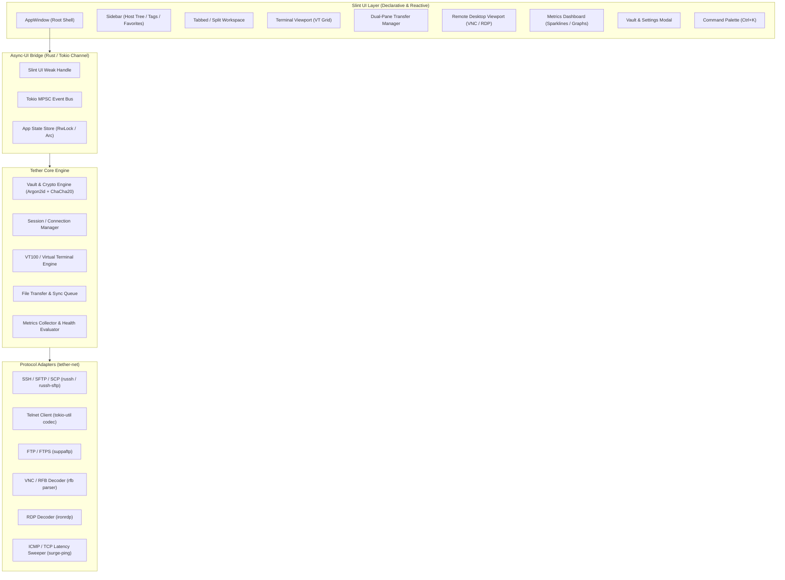
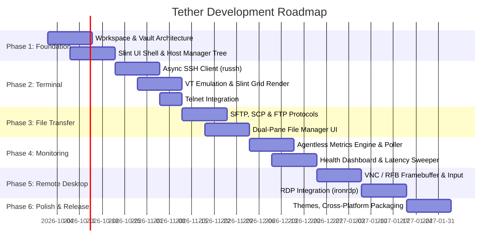

# Project Tether: Master Architectural & Implementation Plan
**Cross-Platform Remote Management, Terminal & Server Monitoring Workbench**

> [!NOTE]
> **Project Tether** is designed as a high-performance, single-binary, cross-platform remote management workbench built with **Rust** and **Slint UI**. It consolidates SSH, Telnet, SCP/SFTP, FTP, VNC, RDP, and real-time server health monitoring into a cohesive desktop environment.

---

## 1. Executive Summary & Vision

Modern systems engineers, DevOps practitioners, and homelab administrators juggle numerous disconnected tools (e.g., PuTTY/Termius for SSH, FileZilla for FTP/SFTP, Remmina/mRemoteNG for VNC/RDP, Grafana/htop for monitoring). 

**Tether** aims to unify these operational workflows into a lightweight, memory-safe, native desktop application with:
1. **Unified Session & Credential Vault**: Zero-knowledge encrypted vault for connections, private keys, jump hosts, and credentials.
2. **Integrated Terminal Emulation**: Full VT100/xterm-256color terminal engine supporting SSH and Telnet.
3. **Dual-Pane File Transfer Suite**: High-throughput file manager for SCP, SFTP, and FTP/FTPS with drag-and-drop and queue management.
4. **Graphical Remote Sessions**: Embedded or pop-out VNC (RFB) and RDP client powered by pure-Rust protocol decoders.
5. **Agentless Server Telemetry**: Real-time host health monitoring (CPU, RAM, Disks, Networks, Processes, Systemd services) polled securely over SSH or ICMP/TCP ping sweeps.
6. **Cross-Platform Native UI**: Powered by Slint 1.18+ with GPU hardware acceleration (winit/femtovg/Skia backend) running seamlessly on Linux, Windows, and macOS.

---

## 2. High-Level System Architecture

---

## 3. Modular Architecture Breakdown

To ensure maintainability, testability, and fast compilation, the codebase will be partitioned into a Cargo workspace:

| Crate / Module | Responsibility | Key Dependencies |
| :--- | :--- | :--- |
| **`tether-core`** | Data models, session configuration, encrypted vault, host inventory, event bus, config persistence. | `serde`, `serde_json`, `zeroize`, `argon2`, `chacha20poly1305`, `keyring`, `directories` |
| **`tether-terminal`** | Virtual terminal state machine, ANSI/xterm escape parsing, cursor tracking, scrollback buffer, clipboard. | `vt100`, `vte`, or `alacritty_terminal` |
| **`tether-net`** | Network protocol implementations and session abstractions (SSH, Telnet, FTP/FTPS, SFTP, SCP). | `tokio`, `russh`, `russh-sftp`, `suppaftp`, `tokio-util`, `native-tls` |
| **`tether-display`** | Framebuffer decoding and pixel conversion for remote graphical protocols. | `ironrdp` (RDP), RFB/VNC decoder, `slint::SharedPixelBuffer` |
| **`tether-monitor`** | Agentless SSH command metrics parsers (Linux `/proc`, `vmstat`, `sysinfo`, `macOS/Windows` equivalents), ping heartbeats, alert thresholds. | `sysinfo`, `surge-ping`, `regex` |
| **`tether-ui` / `src`** | Slint UI definitions (`.slint`), view-models, Slint-to-Tokio async dispatcher, keyboard/mouse event mapping. | `slint`, `slint-build`, `tokio` |

---

## 4. Subsystem Implementation Strategies

### 4.1. Terminal Engine (SSH & Telnet)
- **SSH Engine**: Utilizing `russh` (modern async Tokio-native SSH library) rather than `ssh2` (which binds to C `libssh2` and blocks async workers).
  - Supports SSH agent, PKCS#8, OpenSSH key formats, password, keyboard-interactive, and jump hosts (bastions).
- **Telnet Engine**: Custom Tokio streaming codec handling NVT (Network Virtual Terminal) options negotiation (`DO`/`DONT`/`WILL`/`WONT`).
- **Terminal Rendering in Slint**:
  - Virtual Terminal emulation parsed via `vt100` / `alacritty_terminal`.
  - Displayed in Slint as an optimized glyph grid or direct bitmap canvas rendering using `slint::Image` / `SharedPixelBuffer<Rgb8Pixel>`, handling custom fonts, selection, and keyboard input forwarding.

### 4.2. File Transfer Suite (SCP, SFTP, FTP/FTPS)
- **SFTP**: Powered by `russh-sftp` over the active SSH channel.
- **SCP**: Direct remote `scp -t` / `scp -f` streaming over SSH channel.
- **FTP / FTPS**: Pure-Rust asynchronous FTP client (`suppaftp`) with explicit TLS.
- **UI Architecture**:
  - Classic dual-pane layout (Local Filesystem $\leftrightarrow$ Remote Filesystem).
  - Background async transfer queue with pause/resume, overwrite policies, speed limiters, and progress bars.

### 4.3. Remote Graphical Desktop (VNC & RDP)
- **VNC (RFB Protocol)**:
  - Custom async RFB 3.8 client supporting raw, tight, and copyrect encodings.
  - Updates written into a double-buffered `SharedPixelBuffer` displayed via Slint `Image`.
- **RDP (Remote Desktop Protocol)**:
  - Integrated via `ironrdp` (pure-Rust RDP protocol suite maintained by Devolutions).
  - Handles RDP negotiation, NLA (Network Level Authentication), bitmap decompression, and input event dispatch.

### 4.4. Server Health & Monitoring (Agentless)
- **Agentless Telemetry**: Polled periodically via background SSH sub-channels without requiring third-party agents on target hosts:
  - CPU usage & load average (`/proc/stat`, `/proc/loadavg` or `top -b -n1`).
  - RAM & Swap allocation (`/proc/meminfo` or `free -m`).
  - Storage & Mount point utilization (`df -k`).
  - Network I/O throughput (`/proc/net/dev`).
  - Running processes / Top consumers (`ps aux` / `/proc`).
  - Systemd / Service state (`systemctl list-units --type=service`).
- **Network Heartbeat**: Rapid ping sweep (ICMP / TCP connect latency) to provide real-time online/offline badges in the host list.
- **Slint Visualizations**: Vector-drawn sparklines, gauge rings, and clean status indicators.

### 4.5. Security & Vault Architecture
- **Master Password / OS Keyring**:
  - Master key derived via **Argon2id** (memory-hard key derivation).
  - Vault payload encrypted with **ChaCha20-Poly1305** (authenticated encryption).
  - Optional integration with native OS Keyrings (`libsecret` on Linux, Keychain on macOS, Windows Credential Manager).
- **Memory Hygiene**: Strict use of `zeroize::ZeroizeOnDrop` for decrypted keys and passwords to prevent memory dumps from leaking credentials.

---

## 5. Phased Roadmap & Milestones

### **Phase 1: Project Skeleton & Credential Vault**
- [ ] Refactor root crate into Cargo workspace (`tether-core`, `tether-net`, `tether-ui`).
- [ ] Implement encrypted storage with Argon2id + ChaCha20-Poly1305.
- [ ] Build Slint Modern UI Shell:
  - Collapsible host tree / inventory navigation.
  - New connection dialog (SSH, Telnet, VNC, RDP, FTP).
  - Settings, credential manager, and tag filter.
  - Multi-tab tabbar with status badges.

### **Phase 2: Terminal Engine & Remote Shells**
- [ ] Integrate `russh` Tokio client with key authentication, password prompts, and PTY resize.
- [ ] Implement VT100 / ANSI escape sequence parser and grid state machine.
- [ ] Slint terminal viewport with cursor blinking, font selection, scrollback buffer, and copy/paste.
- [ ] Telnet client implementation and option negotiation.

### **Phase 3: File Transfer Suite**
- [ ] SFTP client integration over existing SSH session channels.
- [ ] SCP streaming transfer support.
- [ ] FTP and FTPS (Explicit TLS) support.
- [ ] Slint Dual-pane File Manager UI (directory listing, permissions, file size formatting, drag-and-drop transfer queue).

### **Phase 4: Host Health Monitoring**
- [ ] Agentless SSH telemetry poller with configurable intervals (e.g., 5s, 15s, 60s).
- [ ] Platform parsers (Linux `/proc`, macOS `sysctl`, Windows PowerShell/WMI over SSH).
- [ ] Ping/heartbeat ICMP/TCP sweeper.
- [ ] Real-time Slint monitoring dashboard (CPU/Memory gauges, disk storage bars, sparkline network charts).

### **Phase 5: Graphical Remote Desktop (VNC & RDP)**
- [ ] VNC / RFB protocol client with dynamic framebuffer rendering into `slint::SharedPixelBuffer`.
- [ ] Mouse and keyboard event forwarding to remote display.
- [ ] RDP integration with `ironrdp`.
- [ ] Display quality, resolution scaling, and clipboard sync.

### **Phase 6: Multiplatform Packaging, Hardening & Release**
- [ ] Cross-platform CI/CD builds (Linux `.deb` / Flatpak / AppImage, macOS `.dmg`, Windows `.msi` / `.zip`).
- [ ] Dark/Light theme switching and keyboard shortcut customizer.
- [ ] End-to-end integration tests and security audit.

---

## 6. Architecture Decisions & Trade-Offs

| Decision | Recommended Approach | Alternative | Justification |
| :--- | :--- | :--- | :--- |
| **SSH Library** | `russh` (Pure Rust) | `ssh2` (libssh2 C FFI) | Eliminates OpenSSL/C build toolchain pain on Windows/macOS; native Tokio async integration without thread pool offloading. |
| **Terminal Render** | Bitmap Canvas Buffer (`SharedPixelBuffer`) | Text element matrix | Text matrices in declarative UI can face high overhead with 80x24x60fps fast-scrolling terminal logs; canvas/bitmap rendering provides stable $60\text{ fps}$. |
| **RDP Client** | `ironrdp` (Pure Rust) | `freerdp` (C FFI) | Pure Rust avoids complex native C compilation requirements and memory safety bugs in protocol parsing. |
| **Telemetry Method** | Agentless (SSH `/proc` polling) | Custom target agent binary | Zero setup required on monitored remote servers; standard SSH privileges suffice. |
