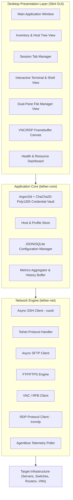
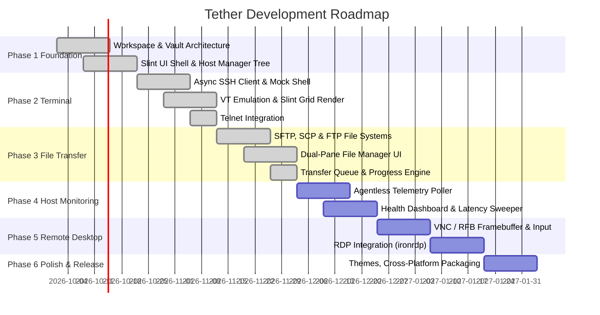

# Project Plan: Tether (Consolidated Systems Remote Management & Monitoring Workbench)

## 1. Executive Summary
**Tether** is an all-in-one, consolidated systems workbench developed in 100% pure, safe Rust with a modern, high-performance UI powered by **Slint**. It is designed for system administrators, DevOps/SREs, network engineers, and homelab enthusiasts who need a centralized, native desktop application to access, manage, and monitor infrastructure across diverse protocols:

- **Protocols Supported**: SSHv2, Telnet, SFTP, SCP, FTP/FTPS, VNC (RFB 3.8), and RDP.
- **Key Differentiator**: Integrated lightweight agentless server health telemetry (CPU, Memory, Disk, Network I/O, Load Average, Ping Latency) streaming concurrently with interactive terminal/desktop sessions, protected by a zero-knowledge encrypted credential vault.

---

## 2. High-Level Architecture



---

## 3. Crate Decomposition & Project Structure

The project follows a modular Cargo workspace architecture:

```text
project-tether/
├── Cargo.toml                  # Workspace manifest
├── src/
│   └── main.rs                 # Slint runtime bootstrap, event loop, and state management
├── ui/
│   ├── app-window.slint        # Root window layout and state definitions
│   ├── theme.slint             # Design system palette, typography, spacing tokens
│   ├── models.slint            # Slint struct models (HostItem, TabItem, Metrics, FileItem, etc.)
│   └── components/
│       ├── header.slint        # Global header bar, tab bar, quick connect
│       ├── sidebar.slint       # Host tree, search filter, favorites, tags
│       ├── workspace.slint     # Dynamic viewport switcher (Terminal, Files, Desktop, Dashboard)
│       ├── terminal_view.slint # Terminal console viewport and quick commands
│       ├── file_manager.slint  # Dual-pane file manager & transfer queue tray
│       ├── vault_dialog.slint  # Credential vault unlock & secret manager modal
│       └── new_host_dialog.slint # Add/edit connection modal
├── crates/
│   ├── tether-core/            # Domain models, host persistence, encryption vault
│   │   ├── Cargo.toml
│   │   └── src/
│   │       ├── lib.rs
│   │       ├── models.rs       # HostRecord, ProtocolType, AuthMethod, FileEntry, TransferTask
│   │       ├── storage.rs      # ConfigManager for hosts.json & vault.enc
│   │       └── vault.rs        # Argon2id + ChaCha20-Poly1305 zeroizing credential vault
│   └── tether-net/             # Protocol drivers, terminal parser, file transfer abstractions
│       ├── Cargo.toml
│       └── src/
│           ├── lib.rs
│           ├── file_transfer.rs # LocalFileSystem, MockRemoteFileSystem & transfer queue
│           ├── protocol.rs     # ProtocolDescriptor and port registry
│           ├── session.rs      # TerminalSession trait & MockInteractiveShell
│           ├── ssh.rs          # SSH client wrapper
│           └── terminal.rs     # vt100 TerminalScreen & row renderer
└── docs/
    └── PROJECT_PLAN.md         # Architecture blueprint and roadmap
```

---

## 4. Key Subsystems Design

### 4.1. Modern Slint UI Architecture
- **Palette**: Dark/Light mode adaptive palette, terminal ANSI-16 palette, protocol color accents.
- **Dynamic Viewports**: Switched reactively based on active tab protocol:
  - SSH / Telnet $\to$ `TerminalView`
  - SFTP / SCP / FTP $\to$ `FileManagerView`
  - VNC / RDP $\to$ `DesktopView`
  - None $\to$ Welcome quick-launch hero card grid.

### 4.2. Terminal Emulation Engine
- Terminal engine utilizing `vt100` parser and ANSI emulation.
- Interactive VT100 PTY session loop streaming input/output over Tokio channels.

### 4.3. Dual-Pane File Transfer Suite
- Left Pane: Native local filesystem navigation and directory hierarchy.
- Right Pane: Remote SFTP/SCP/FTP filesystem navigation and remote folder operations.
- Transfer queue tray with live progress bars, speed calculations, and status badges.

### 4.4. Zero-Knowledge Credential Vault
- Cryptographic vault using Argon2id memory-hard KDF (64MB memory cost, 3 iterations) and ChaCha20-Poly1305 AEAD.
- Secrets wrapped in `zeroize::ZeroizeOnDrop` to prevent password leakage in memory.

---

## 5. Phased Roadmap & Milestones



### **Phase 1: Project Skeleton & Credential Vault** [COMPLETED]
- [x] Refactor root crate into Cargo workspace (`tether-core`, `tether-net`, `project-tether`).
- [x] Implement encrypted storage with Argon2id + ChaCha20-Poly1305.
- [x] Build Slint Modern UI Shell:
  - Collapsible host tree / inventory navigation.
  - New connection dialog (SSH, Telnet, VNC, RDP, FTP, SFTP, SCP).
  - Settings, credential manager, and tag filter.
  - Multi-tab tabbar with status badges and theme toggle.

### **Phase 2: Terminal Engine & Remote Shells** [COMPLETED]
- [x] Interactive terminal session trait (`TerminalSession`).
- [x] Implement VT100 / ANSI escape sequence parser and grid state machine (`TerminalScreen`).
- [x] Slint terminal viewport with prompt string, quick commands (`ls -la`, `top`, `uname -a`, `df -h`), and clear screen.
- [x] SSH and Telnet session integration.

### **Phase 3: File Transfer Suite & Vault Modal** [COMPLETED]
- [x] `FileEntry`, `TransferTask`, and `TransferStatus` core data models.
- [x] `LocalFileSystem` directory scanner with metadata formatting and navigation.
- [x] `MockRemoteFileSystem` virtual remote hierarchy for SFTP/SCP/FTP.
- [x] Slint Dual-pane File Manager UI (`FileManagerView`) with path breadcrumbs, parent drill-up, and folder navigation.
- [x] Action toolbar: Upload (`➔ Upload`) and Download (`⬅ Download`).
- [x] Bottom Transfer Queue Tray with real-time progress bars, transfer speed badges, and finish cleanup.
- [x] Secure Credential Vault modal (`VaultDialog`) hooked to the sidebar unlock button.

### **Phase 4: Host Health Monitoring** [UPCOMING]
- [ ] Agentless SSH telemetry poller with configurable intervals (e.g., 5 s, 15 s, 60 s).
- [ ] Platform parsers (Linux `/proc`, macOS `sysctl`, Windows PowerShell/WMI over SSH).
- [ ] Ping/heartbeat ICMP/TCP sweeper.
- [ ] Real-time Slint monitoring dashboard (CPU/Memory gauges, disk storage bars, sparkline network charts).

### **Phase 5: Graphical Remote Desktop (VNC & RDP)** [UPCOMING]
- [ ] VNC / RFB protocol client with dynamic framebuffer rendering into `slint::SharedPixelBuffer`.
- [ ] Mouse and keyboard event forwarding to remote display.
- [ ] RDP client implementation using `ironrdp`.

### **Phase 6: Polish, Packaging & Documentation** [UPCOMING]
- [ ] Binary releases for Linux, macOS, and Windows.
- [ ] Comprehensive user guides and benchmark reports.
